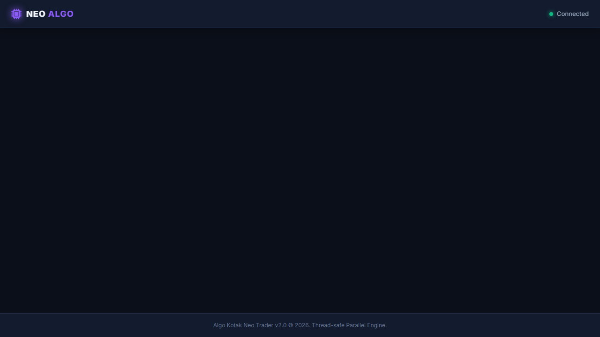
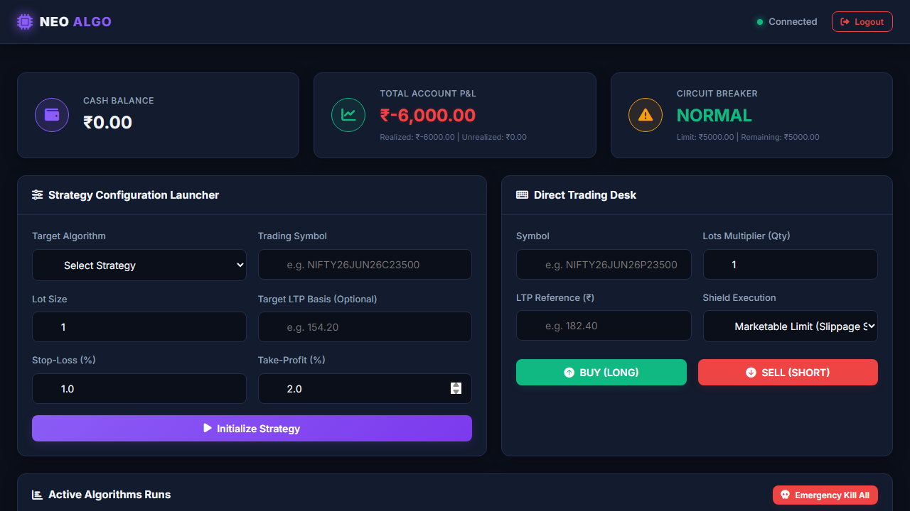
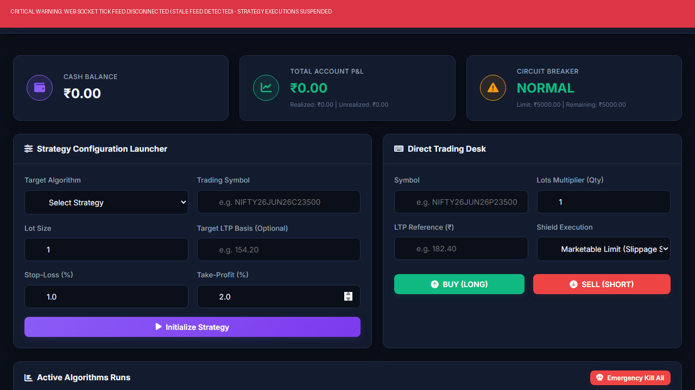
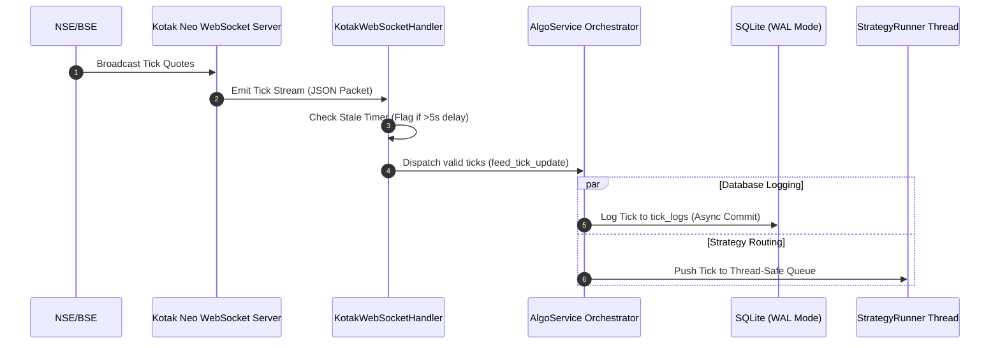
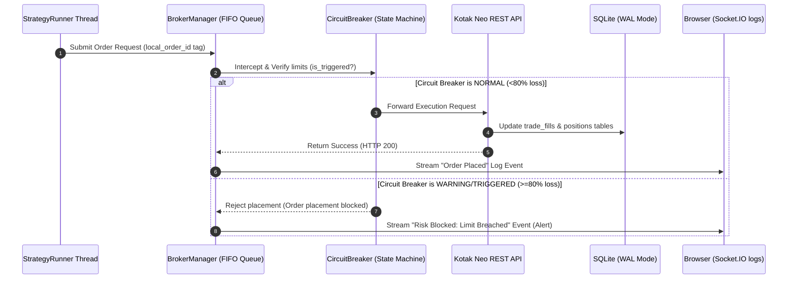

# Kotak Neo Hybrid Algorithmic Trading Platform

A self-contained Python Flask and SQLite-based trading platform that integrates Kotak Neo's API client for manual order execution, real-time WebSocket market data streaming, and autonomous algorithmic strategies.

---

## UI/UX Platform Gallery

The platform features a modern, responsive, glassmorphic dark-theme UI designed to keep active traders aware of account health and algorithmic statuses at all times.

### 1. Secure Authentication Login
Provides step-1 (TOTP) and step-2 (MPIN) security integrations aligned with SEBI's guidelines.


### 2. Main Trading Control Center
Houses manual order forms (limit/market/marketable limit), live system logs streamed via Socket.IO, active positions, and real-time P&L cards.


### 3. Pre-Trade Circuit Breaker Halted (80%+ loss)
Banners turn red and all order placement is programmatically blocked when daily account drawdowns exceed risk tolerances.


### 4. WebSocket Stale Feed Protection Warning
Warns the user and pauses algorithmic strategies immediately if market data feeds stall.


---

## Platform Architecture & Data Flow

Below is the detailed data pipeline showing how live WebSocket ticks are parsed, logged, and routed to trigger automated trade execution, alongside the risk protection filters:

### 1. Market Data Pipeline (WebSockets)


### 2. Order Execution & Risk Pipeline


---

## Features

*   **Dual Mode Execution**: Execute manual orders on options/stocks and run concurrent algorithmic strategy threads (e.g., Exponential Moving Average crossover).
*   **Real-time WebSocket Pipeline**: Subscribes dynamically to instrument tokens and pipes low-latency market ticks straight to running strategy buffers.
*   **Database-backed Recovery**: Stores all active positions, executions, and parameters in SQLite using WAL (Write-Ahead Logging) mode to restore state instantly after crashes.
*   **Multi-layer Risk Controls**: Intercepts orders via a pre-trade Slippage Shield (for marketable limit bounds) and a Circuit Breaker that halts all orders when daily loss exceeds 80%.
*   **Idempotency & Rate Limiting**: Tags all transaction payloads using unique strategy-run local order IDs to prevent double execution over network retries.
*   **Live Console Log Streamer**: Pipes background strategy worker logs and tick telemetry to the browser dashboard using Socket.IO.

---

## Tech Stack

*   **Core Language**: Python 3.13+
*   **Web Framework**: Flask 3.0, Flask-Session, Flask-SocketIO (WebSocket logging)
*   **Database**: SQLAlchemy ORM over SQLite in Write-Ahead Logging (WAL) mode
*   **Data Analysis**: Pandas (scrip master indexing), NumPy
*   **Broker SDK**: Kotak Neo API Client V2 (`neo-api-client`)

---

## Quickstart

### 1. Prerequisites
Ensure you have Python 3.13+ and Git installed on your system.

### 2. Installation
Clone the repository and set up a Python virtual environment:
```bash
# Clone the repository
git clone https://github.com/your-username/kotak-neo-algo-trader.git
cd kotak-neo-algo-trader

# Create and activate virtual environment
python -m venv .venv
source .venv/bin/activate  # On Windows: .venv\Scripts\activate

# Install dependencies (includes pinned Kotak Neo API Client v2)
pip install -r requirements.txt
```

### 3. Configuration
Copy the environment variables template and fill in your credentials:
```bash
cp .env.example .env
```
Open `.env` and fill in your Kotak Neo developer API credentials:
```ini
SECRET_KEY=your_secret_key_here
MAX_DAILY_LOSS=10000.0
MAX_ORDER_VALUE=50000.0

MOBILE_NUMBER=919999999999
UCC=UCC123456
MPIN=123456
CONSUMER_KEY=your_developer_consumer_key
CONSUMER_SECRET=your_developer_consumer_secret
API_PASSWORD=your_api_login_password
```

### 4. Running the Platform
Launch the Flask development server:
```bash
python run.py
```
Open your browser and navigate to `http://127.0.0.1:5000` to access the dashboard.

### Alternative: Running with Docker
The repository includes an Azure-optimized `Dockerfile` for easy containerized deployments (ideal for cloud VMs like Microsoft Azure):
```bash
# Build the Docker image
docker build -t kotak-neo-trader .

# Run the container (injects your local .env credentials automatically)
docker run -d -p 5000:5000 --env-file .env --name trading-platform kotak-neo-trader
```


---

## Usage Example

### Starting a Strategy
1.  Navigate to the web dashboard and log in.
2.  Once authenticated, go to the **Algo Strategy** section.
3.  Select **EMA Crossover** from the strategy list.
4.  Input your symbol (e.g., `NIFTY26JUN26C23500`) and the Lot Size.
5.  Click **Start Strategy**. The background executor will:
    *   Spawn a dedicated strategy runner thread.
    *   Subscribe to the token using the live WebSocket feed.
    *   Initialize tracking logs under `logs/strategy_EMACrossoverStrategy_RUN_[ID].log`.

---

## Project Structure

```
kotak-neo-algo-trader/
├── app/                  # Application source package
│   ├── database/         # Database models, initialization, and connection mappings
│   ├── engine/           # Algorithmic trading base classes and broker interfaces
│   ├── kotak/            # Wrapper interfaces and WebSockets for Kotak Neo API SDK
│   ├── logging/          # Colorized console and file loggers setup
│   ├── routes/           # REST endpoints for dashboard, orders, and sessions
│   ├── services/         # Orchestrators (AlgoService, CircuitBreaker, ScripService)
│   └── strategies/       # EMA Crossover and algorithmic templates
├── assets/               # Dashboard screenshots and diagrams
├── config/               # Base and environment-specific parameters
├── data/                 # Sample Scrip master database index schemas
├── static/               # Frontend CSS, JS, and asset styling
├── templates/            # Web app dashboard HTML files
├── run.py                # Server execution entry point
├── requirements.txt      # Pinned dependency listing
├── .env.example          # Template for environment settings
└── LICENSE               # MIT License
```

---

## Limitations & Roadmap

*   **Mock Execution Testing**: While the WebSocket flow is fully integrated, the platform operates in simulated paper trading mode if Kotak API keys are omitted in `.env`.
*   **Dynamic Options Parsing**: Currently resolves NSE Derivatives (F&O) and Capital Markets (CM) scrips; support for Currency derivatives is planned.
*   **Expanded Strategy Templates**: Support for multi-leg option strategies (Straddles, Strangles) will be added in future releases.

---

## License

This project is licensed under the MIT License - see the [LICENSE](LICENSE) file for details.

---

### Author
*   **Lakshya** - *Lead Developer* - [GitHub](https://github.com/your-github-username) | [LinkedIn](https://linkedin.com/in/your-linkedin-username)
